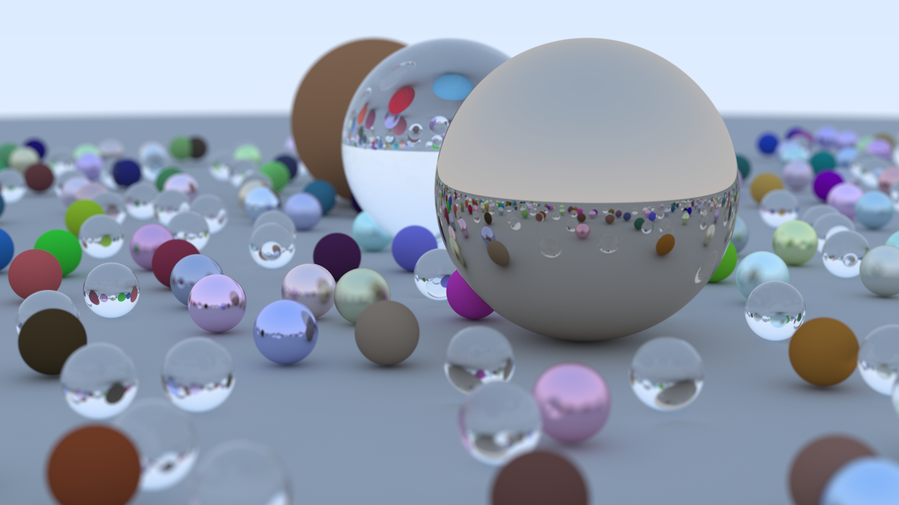

## raytracer

Nothing to see here, just a Rust implementation of [Ray Tracing in One Weekend](https://github.com/RayTracing/raytracing.github.io). 

This implementation renders each scanline in parallel using [rayon](https://github.com/rayon-rs/rayon).

This implementation also automatically caches all output images in `./images/` to keep track of progress throughout development. 
